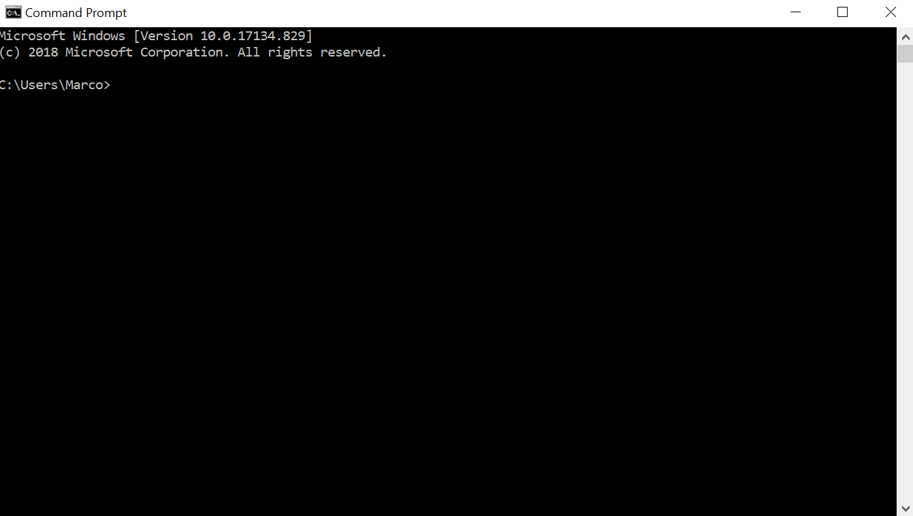
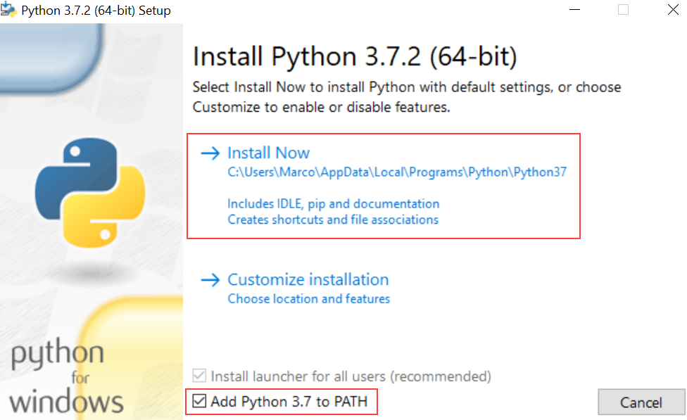
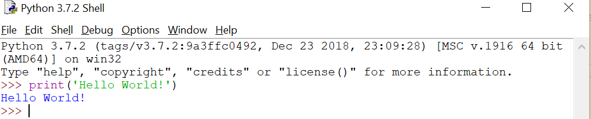
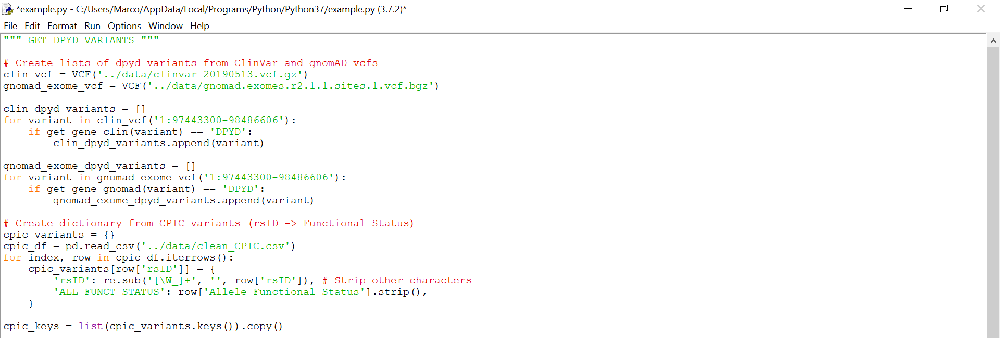
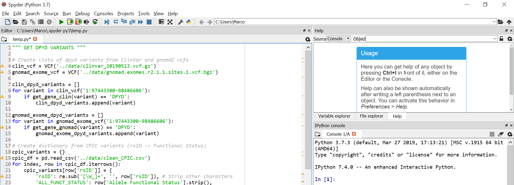
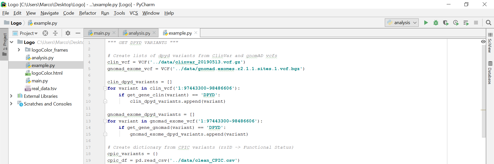
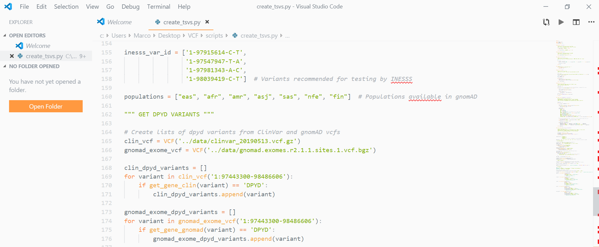

<style>

div.no-overflow, div.book_content, div[role=main]{
    width: 650px;
    margin: auto;
}

div.no-overflow p, div.no-overflow li, div.no-overflow blockquote p{
    font-size: 18px;
    color: #444;
    line-height: 1.6;
    font-family: "Times New Roman", serif;
    padding: 6px 0;
}

div.no-overflow li {
    padding: 2px 0;
}

#region-main a {
    color: #0070a8;
}

blockquote{
    margin-left: 32px;
    border-left-color: #a1cdff;
    padding: 0 16px 8px 16px;
}


div.no-overflow h1, div.no-overflow h2, div.no-overflow h3, div.no-overflow h4, div.no-overflow h5{
    margin-top: 32px;
    font-family: "Times New Roman", serif;
}

</style>
# **PYTHON FOR BIOLOGISTS 1: FUNDAMENTALS OF PROGRAMMING**

# Introduction
Programming is hard. Software engineers, developers, data scientists, etc. spend years coding, writing software and fixing bugs before developing a semblance of competency. Yet, even after so much time spent mastering their craft, most of them will acknowledge that there is a lot they can still learn.

That's why it's important to measure one's expectations. It's very easy to get stuck at the beginning, to feel overwhelmed or like you're just not meant to be a programmer. That's perfectly normal, even expected. The level of competency you will achieve is directly proportional to the amount of effort you put in. Even if you spend 10 hours on this workshop, people who are experienced have put in a thousand times that. Thus, there's no need to worry if you're not a master programmer after a couple of hours. 

Nonetheless, in a few hours, it is possible to learn enough to be able to accomplish useful tasks. To do so, it's important to not just immediately copy and paste the code provided here; instead, try different commands, experiment, see what works and what doesn't. For example, many parts of this workshop contain snippets of code. You're highly encouraged to try running and tinkering with them. Experience truly is the best teacher.

## Requirements
This course assumes you have absolutely no programming experience. What's required is a moderate level of competency with computers (e.g. the ability to download/install programs and files, to type, etc.). We'll do our best to explain everything that should be new to those that have never programmed before as well as bits of terminology that are useful.

If you have already programmed in other languages, some parts of this workshop will feel slow and redundant: skip them and focus instead on the parts that explain the syntax and idiosyncracies of Python. 

## Workshop Goals

By the end of this workshop, you'll be able to write a **script** (set of commands for your computer in a file) that reads through a **.fasta file** (file format for sequence data) and prints out the average **GC content** (percentage of a sequence that is either guanine or cytosine) for sequences in that file. 

More importantly, you'll have a strong grasp of the fundamentals of Python and programming in general which will allow you to write other more complex, more useful scripts for your research.

> **Aside:** This workshop contains many instances of general instructions on how to write Python commands. These will be formatted as follows:
>
>`print("<text to print>")`
>
> For this general instruction on how to print text with Python, we can replace the section with brackets (i.e. the section between `<>`) by whatever text we want to print. 
> For example, if we wanted to print `Apple`, we'd replace `<text to print>` with `Apple` to get the command `print("Apple")`. 

At the end of most sections, a small series of exercises is included. While solutions are available in the Python file `exercise_solutions.py` (you'll need to open them with IDLE by right-clicking on them and choosing `Edit with Idle` to see them), it is highly recommend to attempt them first and persevere without solutions. 

It is perfectly fine if your answers differ. In fact, for any task, there are tons of ways to write functional code for it. While some ways are more efficient or cleaner, it's not expected that you optimize for those criteria just yet.

Don't worry if you're not exactly sure of how to do an exercise. Give it a try. One big difference between running code and running a lab experiment is that code takes almost zero effort/time to try out (literally less than a second). So don't be afraid to try stuff and make mistakes, it's the best way to learn and it costs nothing!

This workshop is the first of many. Once you grasp the fundamentals, it's much easier to learn about Python libraries and how to interact with them. These libraries can allow you to create powerful visualizations, work with massive amounts of data, implement machine learning models and so much more.

Let's begin.

# Getting started - Down the Rabbit Hole

## Why Python?
Since this workshop is designed for biologists, it is worth noting that the vast majority of programming in bioinformatics is done in either Python or R. Between the two, Python is more beginner-friendly, more versatile (it can be used to do almost anything, including making websites, creating games, training machine learning models, building servers, etc.) and generally has more potential for use in bioinformatics.

In addition, learning Python is a good base for understanding general programming concepts without getting bogged down by syntax and technicalities (it's considered a high level language, meaning that it's not necessary to worry about low-level issues like memory management).

## Installing Python

There are 2 versions of Python: Python 2 and Python 3. Even though many aspects of the 2 versions of the language are the same, there are enough differences that many programs written for Python 3 cannot be run in Python 2 and vice versa. As expected, Python 3 is the newer version with more features while Python 2 is set to lose official support in 2020. 

For this reason, we'll be using Python 3 exclusively. Unfortunately, Python is not pre-installed on Windows system and the version installed on macOS is 2.7 by default.

Thus, before proceeding, we need to download and install Python 3. To do so, first check if you have it installed by going to your terminal (command prompt for Windows) and using the command:

 `python -V`
 
 If you get an error, it means that Python isn't installed. If it is installed, it'll display the version you have (if your version number doesn't start with 3, you'll need to install Python 3).

>### Aside: Using the terminal
> A terminal is a text interface that allows us to type commands for our computer to execute. The result of those commands is then shown. 
> 
> While it may seem intimidating at first (something from a hacking scene in a movie), just think of it as a chat room where you can type messages to your computer. Once your computer executes the command, it might send a message back.
>
> - To open the terminal in Windows (called Command Prompt, since it prompts you for commands), press the `Windows button + R` and type in `cmd`, then press `Enter`.
>      - If you're not sure where the Windows button is, you can click on the Windows icon in the bottom left and search for `cmd`.
>
>- To open the terminal on a Mac, press `Command + Spacebar` and search for `Terminal`.
>
>Once it's open, you should see a mostly black window with a blinking cursor. We can now type our commands and see their results. Try typing:
> 
> `echo "Hello World!"` 
> 
> and then press enter to run the command. You should see the line `Hello World!` appear. The `echo` command makes your computer display whatever text you tell it to, in this case `Hello World!`.
 <p style="text-align: center;">*Window's terminal*</p>


If you don't have Python installed, or the wrong version, you'll need to download it and install it (just like you would install a program). You can find the download links for different systems below.

- [For Windows, 64-bit](https://www.python.org/ftp/python/3.7.3/python-3.7.3-amd64.exe) (almost all computers from the past 5 years use a 64-bit architecture).
- [For Windows, 32-bit](https://www.python.org/ftp/python/3.7.3/python-3.7.3.exe) (if your computer is older and you're [unsure what architecture it has](https://www.sharekhancommodity.com/ComTiger/Check32_64bit.pdf)).
- [For Mac](https://www.python.org/ftp/python/3.7.3/python-3.7.3-macosx10.9.pkg).

Once the file is downloaded, double click it to run it. Make sure the "Add Python 3.7 to PATH is checked" for the Windows installation. Otherwise, just use the default settings and go through the installation process.

<p style="text-align: center;">*Options to select (Windows)*</p>

Here are some useful videos if ever you get stuck:

- [Windows](https://www.youtube.com/watch?v=ndrCfBJkkvE&t=438s)
- [Mac](https://www.youtube.com/watch?v=uA8SA81nivg)


## Python Interpreter

Now that we've installed Python, we can finally start testing out commands! To do so, we'll open up IDLE, a program that comes bundled with Python and lets us use the **Python interpreter** (program that reads and executes our Python commands).

- On Windows, press on the `Windows` button to bring up the search bar and search for `IDLE`.
  - You can also click on the Windows icon at the bottom left.
- On Mac, press `Command + Space` and search for `IDLE`.
- If you still cannot find IDLE, you can use an [online interpreter](https://repl.it/languages/python3).
  - The black console on the right is the interpreter and the section on the left allows you to edit and run Python scripts.


Once open, we're greeted with the Python interpreter in a terminal like interface (i.e. a blinking cursor prompting you for your next command). The interpreter uses a REPL (Read-Evaluate-Print loop) meaning that it:

1. Starts by reading our command. When our terminal displays `>>>>`, it is prompting us to enter a command (which we do by typing in the text for the command).
2. Once we've typed in an instruction, we press `Enter` to get the interpreter to evaluate the command.
3. If the command we entered returns something, the interpreter will print it out (some commands return data while others don't, more on this later).
4. Finally, once the command has been executed, the interpreter returns to prompting us for a command (this cyclical behavior is referred to as a **loop**).

With that in mind, let's get to writing our first command. The prototypical example of a first program in any language involves printing out the words `Hello world!`. In Python, this involves using the command: 

`print("Hello world!")`

If we type the characters above exactly into the interpreter, we will get the following output.

<p style="text-align: center;">*The Python Interpreter*</p>

## Writing Python Code and Scripts

While the REPL is great for testing quick commands and getting immediate feedback, it's not great when it comes to writing longer, reusable scripts (with the REPL, we can only enter one command at a time, in a script we can specify a sequence of commands to be run). 

To do so, we need a way to create, edit and save the code in a script, using either a **text editor** or an **IDE** (Integrated Development Environment, basically a program that allows you to edit your Python code while providing extra functionality like highlighting syntax errors, providing easy ways to run your code, debugging, etc.).

There are many options for both, the best one will depend on your personal preferences, what you're using Python for and your level of expertise. Here are some good options:

- **IDLE:** Bundled with Python, IDLE can be used for more than just interacting with the REPL. IDLE is a very simple IDE that makes it easy to start coding without overwhelming you with options. It is more than enough for everything we'll be doing in this workshop.

- **Spyder:** If you have installed Anaconda (a Python distribution filled with scientific computing packages), you most likely installed Spyder as well. Slightly more complex than IDLE and with more features, it is still easy to use and offers an experience similar to RStudio. The variable explorer can also come in handy.

- **Pycharm:** Pycharm is a fully-featured Python IDE used by many professional software engineers. Of all those mentioned so far, it has by far the most features while still offering good customizability and a good out of the box experience. However, all these features often make it slow and the amount of options can be overwhelming at times. While the professional version requires a license, the community edition is free and still has plenty of features.

- **VS Code:** Visual Studio Code is essentially a text editor that can create an IDE like experience with the right extensions. It is widely used and highly customizable with thousands of extensions and themes. It is also great if you need to write code in other programming languages. Nonetheless, the setup is a bit lengthier and might be less user-friendly than say, IDLE or Spyder.


For each of these editors, their theme and overall look can be customized so don't worry if you don't like some of the colors in the pictures above.

As for our recommendation, we'd highly suggest sticking with IDLE if you're a beginner (at least till the end of this workshop). After, it would be beneficial to switch to a more complete editor.

Regardless of which you choose, **the general process of creating and running a Python script remains the same.**

1. In the editor of our choice, we create a new file (usually by going to File > New File in the menu on top).
2. Save the file (either using `CTRL+s` or `CMD+s`, or go to File > Save) in a place you can access .
3. Make sure to save the file with the .py extension so that the full name is `<filename>.py`.
4. Edit the file to include the Python commands we want to run.
5. Save our changes.
6. Run the script:
     - IDLE: Go to Run > Run Module.
     - Spyder: Click on the green run button.
     - Pycharm: Go to Run > Run.
     - VS Code: Use the Code Runner extension and click on the run button.
7. Edit our scripts again and repeat!


> **Aside:** Running the script is equivalent to running each command in it, sequentially.

The steps described above are the basic workflow for writing and running Python scripts. Scripts can also be run from the terminal.

> ## EXERCISE: WRITING SCRIPTS
> 
> Before proceeding, let's create a script to use for the upcoming exercises. 
> 
> 1. Open up IDLE.
> 2. Create a new file.
> 3. Save it as `exercises.py` in a location you can easily access (like `Documents`). 
> 4. Once it's saved, go back to IDLE.
> 5. Add the line `print("Hello World!")` to the file.
> 6. Press `F5` or click on `Run > Run Module` (menu at the top of the file) to run the script.
> 7. Make sure the script executed and printed `Hello World!`.

For the following exercises, you can edit the code of this newly created script and then run it to see if your code works. If ever you close it, just navigate to where you saved the script, right click it and choose `Edit with Idle`.

# Python Basic - Building the Foundations

Before we start writings scripts, we need to understand how the programming language Python works. Like any language, Python has a set of words/symbols that it uses and rules about how to put those words/symbols together.

When used properly, we can combine these words together to create commands for Python. A script is usually just that, a series of commands. 

Thus, becoming proficient in Python is a lot like learning another spoken language. We need to understand the **vocabulary** (all the commands that we can use in Python), the **grammar** (how commands are combined to create more complex processes) and the **syntax** (what symbols we need to put where for our commands to be understood).

Unlike spoken languages however, precision is absolutely necessary when it comes to programming. While "He eat chicken." is not grammatically correct, we can easily grasp the meaning of the sentence. On the other hand, not following the syntax rules of Python **will break our script**. 

To start, we'll learn about Python's "grammar", i.e. the metaphorical equivalent of nouns, verbs, etc.

## Objects

In Python, information is manipulated through the abstract notion of **objects**. Like real world objects, an object in Python is essentially an entity. These entities can be simple (like a single number) or complex (like a DNA sequence).

Instead of existing physically however, these objects exist solely as 1s and 0s on our computer's memory. This doesn't stop us from interacting with them through Python commands.

Let's take a concrete example. Earlier, when we used the command `print("Hello World!")`, we used a **string** object. A string object is just a series of letters, numbers and punctuation symbols (in this case, the string object was `"Hello World!"`).

We then used the print command (usually called a **function**) on the string object to get Python to display it on our screen. Commands can also be used to transform objects, delete objects, create objects, etc.
 
Don't worry if you're a bit confused at this point; the notion of objects is abstract and hard to grasp at first. What's important is to understand that when writing a script, we're essentially **writing commands that take objects and do something with them.**

> **Aside:** When working with strings, Python syntax (and the syntax of most programming languages) requires us to surround them with either apostrophes or quotation marks. This is mainly done so that Python doesn't confuse a string with a command or a variable name.


## Variables

How can we keep track of these objects? This is the most commonly done through the use of **variables**. We can think of variables like named boxes inside of which we can put a single object (which we call the variable's **value**). In math class, these variables contained numbers, in Python they can contain any object.

To metaphorically put an object inside that box, we **assign** a value to a variable (an object). The syntax for that in Python is: 

`<variable name> = <value>`

From our initial example, we can create a variable called `greeting` and assign it the value `"Hello World!"`.


```python
greeting = "Hello World!"
```

We can assign any object to a variable. For example, we can create a variable called `x` and assign it the value `5` (a number object, called an **integer**) or a variable called `name` with the value `"John"` as follows.

```python
x = 5
name = "John"
```

Adding these lines to your script and then running it won't give us any output. The reason for this is that we aren't printing anything yet, we are just assigning values to variables. Nonetheless, the interpreter is now keeping track of the variable `x` and the fact that it has value `5`. In other words, the assignment command made Python create a box with the label `x`, inside of which is the number `5`.

To see this, we can run the command `print(x)` which will print the object contained in the variable `x` (and thus we should see `5`).

We can also reassign the value of a variable by using the same command structure (e.g. `x = 7`). Doing so and running `print(x)` again will yield `7`. 

Variables can also have longer, more descriptive names (e.g. `number_fingers = 10`). However **spaces cannot be used in variable names** (use either `_` or `-` instead). 

Finally, we can assign to a variable the value of another variable. To do so, we use the syntax:

`<variable 1> = <variable 2>`

For example `y = x` would give to `y` the value of `x`, i.e. 7.

## Printing
Printing in a programming context refers to the act of displaying text as output. The `Hello World!` command we wrote earlier **prints** the words `Hello World` to the terminal.

To print something in Python, we use the print function as follows:

`print(<thing to print>)`

You can print anything that can be converted to a string (i.e. in to words). If you print a variable, Python prints the **value of the variable**. For example, from the previous examples,

```python
x = 5 
name = "John"
print(x)
print(name)
```
Will print first the value of `x` and then the value of `name`.

## Object Types
So far we've only dealt with integers (whole numbers) and strings (words). There are other basic types of information that can constitute objects: 

- **Strings:** Either characters, words, sentences or paragraphs. To create a string, we need to surround the words we want either with apostrophes (`''`) or with quotation marks (`""`).
- **Integers:** Whole numbers.
- **Floats:** Non whole numbers (e.g. 2.431, 8.9, etc.) 
- **Booleans:** A boolean is a value that is either `True` or `False`. They are very useful for controlling the flow of our program or implementing logic, more on that later.

How can we create objects of these types?

- **Strings:** Type the words you want, surrounded by quotation marks, `""`.
  - To create a string consisting of a number, we surround the number by quotation marks, `""`.
```python
"The weather is beautiful today."
```
- **Integers:** Just type the whole number.
```python
128
```
- **Floats:** Just type the non-whole number (with a . for the decimal part).
```python 
3.2
```
- **Booleans:** Type either `True` or `False`, without quotation marks.
```python
True
```

However, if we just create these objects in our script, nothing will happen. For example, try adding the lines below to your script and running it.
```python
"The weather is beautiful today."
128
3.2
True
```
To get these objects to actually do something, we need to either **use** the object or **store** the object (for example in a variable). Or else, the objects essentially disappear from memory.

Using the objects directly would involve using a command on them:
```python
print("The weather is beautiful today.")
```
In the line above, we create a string object and use the command `print` on it.

We could also do this indirectly by first assigning the object to a variable (and thus putting it in a box, storing it) and then printing the variable. When we use a command on a variable, it is equivalent to using the command on the value of the variable.
```python
weather = "The weather is beautiful today."
print (weather)
```

The process is similar for other object types (just with no quotation marks for object creation).

```python
number = 128
print(number)

fraction = 0.25
print(fraction)

boolean = True
print(boolean)
```

> **Aside:** One of the most confusing issues for beginners is when to use quotation marks (`""`) and when not to. Using them incorrectly will unfortunately either break your script or make it malfunction. 
>
> Quotation marks **are only used to create strings**. 
> 
> **Do not use quotation marks to**:
> 
> - Create integers, floats or booleans.
> - Create variables, even if their name is a word.
> - Surround variable names, anywhere in your program
> - Surround names of functions (commands)
> ```python
> integer = "2"
> fraction = "0.25"
> boolean = "True"
> "variable" = "hello"
> print("integer") 
> "print"(fraction)
> ```
> ^ The main missuses of quotation marks.

Now that we both know how to create objects and assign them to variables, we can do the following.

> ## EXERCISE: OBJECT TYPES
> Open up your `exercises.py` script in IDLE. Then, write a script that:
> 
>  1. Creates the following variables with the following values:
>       - `num_sequences` with value `12`.
>       - `is_sequence` with value `True` (a boolean).
>       - `sequence_1` with value `GATC` (a string, don't forget quotation marks!).
>       - `sequence_2` with value `CCTA`.
> 
> 2. Prints these variables.
> 3. Creates a variable called `my_name` and assign it as value your name.
> 4. Prints the variable.
> 5. Changes the value of the variable to a nickname.
> 6. Prints the variable again.

## Collections
Often, it is very useful to group objects together. Fortunately, Python has object types that correspond to collections of objects.

### **Lists**
Lists are the simplest type of collection in Python. As their name implies, they can be thought of as a list of objects, each of which has a specific position (its **index**). Lists are **mutable**, meaning they can be changed (objects can be added to the list or removed).

For example, if we wanted to keep track of the names of the people in our lab, we could create a list of names: 

`lab_names = ["Name 1", "Name 2", "Name 3"]`

Here we are creating a variable called `lab_names` and assigning it as value a list (lists are objects too!). 

Then, if someone joined our lab, we could add them to the list with:

`lab_names.append("New person name")`

List can be made of any object type, even other lists!

To access an element of a list, we use the following syntax:

`lab_names[1]`

which accesses the element at index 1.

> ### Aside: Indexing
>  A special convention for Python (and the vast majority of programming languages) is that the item at index 1 is **not** the first item. 
> 
> Indexing starts at 0, meaning that the first item is at index 0, the second at index 1, etc. Thus, `lab_names[1]` will return `Name 2` since it is the second item of the list (and thus the item at index 1). 


  - To add an element to the end of the list, use `lab_names.append("Name 4")`.
  - To remove an element, use `lab_names.remove("Name 2")`.
  - [For other list operations that can be done](https://docs.python.org/3.7/tutorial/datastructures.html).


### **Dictionary:** 
In cases where we have a group of uniquely labelled objects (for example study subjects who each have their own ID) we use dictionaries. We can create a dictionary object to store them as follows (`subjects` is the variable name):

`subjects = { "123a": "Subject1", "234b": "Subject 2" }`

Here, the IDs are referred to as **keys** while the subject names are the associated **values**. In the example above, we use string objects as keys but we could use other object types such as integers. However, **keys must be unique**, there cannot be 2 values with the same key. 

Literal dictionaries have a similar structure to dictionary objects. We can think of the **words** as the **keys** and the **definitions** as the associated **values**.

  - To access a particular subject, use `<dict_name>["<key_name>"]`, like so: `subjects["123a"]`.
  - To get a `list` of all the keys in the dictionary, use `subjects.keys()`.
  - To get a `list` of all the values in the dictionary, use `subjects.values()`.

### **Tuples:** 
Tuples are **immutable** (meaning they cannot be changed) collections of objects. They can contain as many objects as we want, of any type we want. For example, if we wanted to store the four letters of the genetic alphabet, we could do so as follows: 

`letters = ("A", "T", "G", "C")`

which creates a variable called `letters` whose value is a tuple of four string objects (tuples are objects and thus can be assigned to variables). Other examples of information that we could represent as tuples would be XY coordinates `(15, 24)` or even names `("First name", "Last name")`.

Elements of a tuple can be accessed using the same syntax as lists:

`letters[1]` 

which will return the item at index 1 in the tuple `letters`.

In terms of syntax, all three collection objects use different types of brackets.

- `[]` for lists.
- `{}` for dictionaries.
- `()` for tuples.

**Between each element in the collection, remember to put a comma.** 

> ## EXERCISE: COLLECTIONS
> 
>  1. Create two tuples, `pair_1` and `pair_2`, one for each pair of bases with their elements being strings corresponding to the bases (ex: `pair_1 = ("G", "C")`).
>  2. Create a list called `pairs` and add both pairs to it.
>  3. From the list, access the first base from the first pair.
>       - You can do this part in 2 steps or in 1 by using: `pairs[<pair index>][<letter index>]`
>  4. Create a dictionary called `bases` with **keys** corresponding to the letters of the bases and **values** corresponding to the full names of the bases (`guanine`, `cytosine`, etc.)
>  5. Access and print `guanine` from the dictionary.


## External Libraries
Python has a lot of functionality built-in. However, there is a lot more available through external libraries (pieces of code that you can import and use).

To use an external library:

1. Import it with `import <libary name>`
2. Use the functionality of the library with `<library name>.<function name>`

For example, the following code prints the current time (in seconds since 1970):
```python
import time
print(time.time())
```

We can also change the name of the library when we import it (commonly done for `numpy` and `pandas`, to be seen in the next workshop):
```python
import numpy as np
print(np.zeros(5))
```

These libraries are included with the standard installation of Python, some other libraries need to be installed separately (more on this in the next workshop). Other popular libraries include:

- `requests` for interacting with devices through the Internet.
- `pandas` for simplifying the process of dealing with data. 
- `sklearn` for implementing machine learning models.
- `random` for implementing randomness.
- `pygame` for creating games.
- `flask` for creating websites.

and the list goes on.

## Math

As with any programming language, Python is capable of complex mathematical operations as well as everything you can do on a scientific calculator.

- For basic operations, `+ - * /` are used for addition, substraction, multiplication and division respectively.
    - For example, we can write `2 + 4 * 3 / 4 - 8`.
      - The expression above evaluates to `-3` since Python follows the standard order of operations.
    - We can also add parentheses if we want certain expressions to be evaluated first.
      - `(2 + 4) * 3 / 4 - 8` yields `-3.5` instead.
- **Exponentiation** is achieved with the `**` operator (i.e. `2**3` evaluates to 2 to the 3rd power, or 8).

For more complicated mathematical operations, we need to import the `math` library. To do so, we simply use the command `import math`. Once that's done, we can use the methods of the math library with `math.<method>(<arguments>)`:

- **Logarithms:** Use `math.log(<number>, <base>)`. For example, `math.log(100, 10)` returns `2`.
- **Rounding:** Use `math.floor(<number>)` to round down, `math.ceil(<number>)` to round up, and just `round(<number>)` for general rounding 
- **Trigonometry:** `math.sin(<number>)`, `math.cos(<number>)`, etc. return the sin, cos, etc. of the provided numbers.
- **Constants:** Constants such as `pi` or `e` can be accessed with `math.pi`, `math.e` respectively.

These are just some of the mathematical tools available in Python. Tons more can be found [here](https://docs.python.org/3/library/math.html) in the documentation. There are also myriads of other math-related libraries which can easily be found by searching on Google.

> ## EXERCISE: MATH
> 
> 1. Print the area of a circle of radius 3, rounded down (pi times radius squared).
> 2. Print 23 to the 24th power.
> 3. Print 8 * 4 / 2 - (3 * 2) - (16 + 5).


## Comments
Comments are useful for describing parts of our code that are confusing or that would need to be explained if someone else read our code. They allow us to write text in our script **that is not evaluated by Python**. There are 2 types of comments:

- Single line comments: As the name implies, they allow us to write a comment on a single line. Structured as follows
  
```python
# <comment text>
```

We can also write them at the end of a line of code like so :

```python
print(names) # Prints names of lab members
```
  - Multi-line comments: Allow us to write comments that span multiple lines:

```python
"""
This is a multi-line comment.
It is very long.
It can be as long as you want.
"""
```


> ### Aside: Overcommenting 
> While it is definitely good to comment our code, we need to avoid the temptation of overcommenting (i.e. writing comments for pieces of code that are self-evident).

# Python Essentials - Making Things Interesting

## Logical Operators

As our programs get more complex, **control flow** (i.e. which commands are executed when) becomes an important issue. To deal with this, we use conditional statements that execute different blocks of code depending on the state of the program.

To do so we need **boolean expressions**, a fancy way to describe expressions that are either `True` or `False`. To illustrate, here are the most important operators and how they can be used to create boolean expressions:

 - `a == b` simply checks for equality between both objects.

```python
2 == 3 # Returns False
``` 
 - `a != b` checks if both objects are not equal.

```python
2 != 3 # Returns True
```

 - `<`, `>` can be used to check if the element on the left is smaller than or greater than the element on the right.
   - Adding a `=` sign like `<=` checks for smaller than or equal to.

```python
2 <= 3 # Returns True
3 <= 3 # Returns True
```
 - If you have a collection (like a list or a tuple), you can check if an object exists in that collection with the `in` keyword.

```python
names = ["John", "Mary"]
"John" in names # Returns True
```
 - There are some functions that return boolean values.

```python
"ATGCGTA".startswith("A") # Returns True
```

We can combine these basic building blocks to create more complicated expressions with the keywords `or`, `and`. 

To do so, we take two expressions that return booleans. We can then write: 

- `<expr 1> and <expr 2>` 
  - Returns `True` only if both `<expr 1>` and `<expr 2>` are both `True`.
- `<expr 1> or <expr 2>` 
  - Returns `True` if either `<expr 1>` or `<expr 2>` are `True`.

Using this, we can write expressions such as:

- `"a" == "b" or "a" == "a"`
  - `True` since the second statement is `True`.
- `1 < 2 and 3 > 4`
  - `False` since only the first statement is `True`.
- `'(1 < 2 or 3 > 4) and "a" in ["a", "b", "c"]` 
  - `True`. The expression within the parentheses is evaluated first, leaving us with `True and "a" in ["a", "b", "c"]`, which evaluates to `True` since both statements are `True`.

Finally, the `not` keyword put before a boolean expression inverses it (transforming `True` to `False` and vice versa).

```python
print(not True) # Becomes False
print(not 2 == 3) # Becomes True
```

## Conditionals

With these operators, we are now ready to work with **conditionals** (commands that check a condition before executing a piece of code). The simplest form of this is the `if` statement of which the general structure is given below.
```python
if <condition>:
    #<code to run>
```
It starts with the keyword `if`, followed by a condition (i.e. any boolean expression) such as `x < 2`. After the colon, the code that needs to be run when the condition is met is put on an **indented** line (i.e. preceded by a tab).

We can also specify code that will be run only if the condition is not met (these are called **if/else** statements). A lot of daily life can be seen as if/else statements. 

If it is raining outside, bring an umbrella, if it is not raining, don't. If we are hungry, eat a snack, or else keep working etc. To use an else statement, simply put the `else` keyword with a colon.

```python
if <condition1>:
    <code to run if condition1 true>
else:
    <code to run otherwise>
```

Finally, we can check for multiple conditions by using the `elif` keyword. 

The code below will first check for condition 1. If it is met, it will run the code there. If not, it will check for condition 2. If neither are met, it will run the code in the else statement.


```python
if <condition1>:
    <code to run if condition1 true>
elif <condition2>:
    <code to run if condition2 true (only runs if condition 1 is also false)>
else:
    <code to run otherwise>
```

For each of these pieces of code, **indentation is important**. After writing the line with the `if` keyword, the next lines specifying the code to run need to start after either a `tab` or at least a `space`.

Try running the following piece of code after replacing the value of the variable `name` with your name (be sure to capitalize the first letter).


```python
name = "<put your name here>"

first_letter = name[0] # The individual characters of strings can be accessed like the elements of a list (here we get the first character of the string name).

first_letter = first_letter.upper() # upper() transforms a string to uppercase letters. Doing so ensures our script will work even if you wrote your name without uppercase letters since "a" is not equal to "A" for Python.

if first_letter in ["A", "E", "I", "O", "U", "Y"]:
    print("Your name stars with a vowel!")
elif first_letter == "B" or first_letter == "C":
    print("Your name starts with a B or C!")
else:
    print("Your name begins with another letter!")
```


> ## EXERCISE: CONDITIONALS
> 1. Create a variable called `sequence` and assign it a sequence string of your choice.
> 2. Using `if`, `elif` and `else`, write a program that prints out the full name of the base `sequence` starts with (e.g. if the sequence begins with `G`, the script should print `Guanine`).
>       - `<string>.startswith("<letter>")` returns `True` if `<string>` starts with `<letter>`.
> 3. Modify the script so that it prints the string `GC` if `sequence` starts with a `G` or a `C`.

## Loops

One of the most powerful abilities of computers is the potential to repeat the same action millions of times in a row, without stopping. To get them to do so, we need loops. Loops repeatedly execute the same piece of code, with small changes between each **iteration** (one execution of the code).

Let's start by looping over the elements of a tuple/list (both use the same syntax). Suppose we have a list of names `names = ["John", "Mary", "Bob", "Steve", "Jane", "Hannah"]` and we want to say hello to each of them. Instead of writing:

```python
print("Hello " + names[0])
print("Hello " + names[1])
...
```

We can loop over the names in the list with a **for loop**:

```python
for name in names:
    print("Hello " + name)
```
What's happening here is that, the variable `name`  is being assigned the value of the first element of the list. 

Then, the code is executed (i.e. we print the greeting) and the first iteration is done. `name` is then assigned the value of the second element and the process goes on until the list is exhausted (the same can be done for tuples). 

While here we use the variable name `name`, we could use anything else (although short, descriptive names are best).

Looping over dictionaries is more complicated. Since they're essentially a collection of keys and associated values, using a for loop like above **will only loop over the keys**. To loop over the values, we need to use `<dictionary name>.values()` which returns the values of the dictionary as a list (as seen below).
```python
dict = {"a": 1, "b": 2, "c":3}
for value in dict.values():
    print(value)
```

It is also possible to loop over both the keys and values simultaneously. To do so, we use `<dictionary name.items()>`, providing 2 variable names (the first one being for the key, the second for the value).

```python
for key, value in dict.items():
    print("Letter:" + key)
    print("Number:" + value)
```

Oftentimes, we want to loop over a series of numbers, or just repeat the same piece of code x amount of times. Luckily, Python has the range function for us, which returns a range object (essentially a list of numbers). The range function can be called with 1, 2 or 3 arguments:

- `range(100)` will return a sequence of numbers starting at 0, until 100 (100 is not included).
- `range(10, 100)` will return a sequence of numbers starting at 10, until 100.
- `range (5, 50, 2)` will return a sequence of numbers starting at 5, until 50, created with steps of 2 instead of 1 (i.e. 5, 7, 9...).

Thus, if we want to print the string `Hello`,  50 times, we can just do the following:

```python
for i in range(50):
    print("Hello")
```
Or to get the sum of the first 100 numbers:
```python
sum = 0

for i in range(101):
    sum += i // The += operator assigns to the object on the left its current value plus the value of the object on the right.

print(sum)
```
Here, like in the list example, the variable `i` starts with the value of the first element of the range, then the code is executed, then `i` takes on the value of the second element of the range and so on.

Finally, there is the while loop. As the name implies, the while loop will run a certain piece of code while a condition is true.
```python
while <condition>:
    <code to run>
```

> ## EXERCISE: LOOPS
> 1. Create a variable called `two` and set it equal to 1.
> 2. Create a `while` loop that, every iteration, doubles the value of `two` and prints it out. Have it stop when `two` is bigger than 10000.
> 3. Create a dictionary called `sequences` where the keys are sequence IDs and the values are actual sequences (as strings).
> 4. Loop over the keys and values, printing for each pair `Sequence <sequence ID> starts with a <first letter of sequence>`.
>       - To access the first letter of a string, use `<string>[0]`.
> 5. Print all even numbers between 0 and 100 using a `for` loop and a `range`.


## Functions
With functions, we have access to one of the most powerful programming tools. Functions can be thought of as a machine with a conveyor belt passing through it. What we put on the conveyor belt, as input for the machine, are the function's **arguments**. What comes out the other end, after being processed by the machine, is what the function **returns**.

> **Aside:** Not all functions return objects, some simply do something, like `print`.

So how do we create these powerful machines? We need to follow Python's syntax which follows:

```python
def <function name>(<argument 1>, <argument 2>){
    <code>
    return <value to return> #If our function doesn't return anything, we'd omit this line
}
```

Here we are **defining a function**, essentially telling Python "Hey! Here's a function called `<function name>` that takes these arguments and does this". 

**Defining the function does not execute the function**. To execute the function we need to **call** it after it's been defined with the command `<function name>(<argument 1>, <argument2>)`. Think of it as the difference between creating and using a machine.

Let's create our first function which **takes as argument** (input) a number and **returns** (outputs) the base 10 logarithm of this number, + 7. To do so, we first create the function's skeleton:

```python
def log_10 (number):
    return
```

Great! We defined a function called `log_10` and specified that it takes one argument, which will be assigned to the variable `number`. 

To call our function, we just need to write the function name with the arguments in parentheses:

`log_10(5)`

So far, if you run the code above, nothing will happen. This is due to two reasons. First of all, **returning is not the same as printing**. To actually see something in the output screen that was returned we need to surround it with `print()`, like `print(log_10(5))`. 

Adding this should give you an output of `None`, the reason for this being that we're not returning anything!

Let's modify our function so that it actually returns the base 10 logarithm, + 7:

```python
def log_10 (number):
    return math.log(number, 10) + 7
```
To access the argument that's given to a function, we simply use the name we gave it when we defined our function (in this case `number`). Thus, by calling `math.log` on `number`, we are essentially applying the logarithm to whatever number is passed to the function `log_10`. 

`print(log_10(100))` will output `9`, `print(log_10(1000))` will output `10` and so on.

While this setup will work for most cases, we can still make it more robust. Since we cannot take the logarithm of a negative number, we should check for the possibility that a negative number is provided as an argument. To do so, we use the conditional statements we learned about previously.

```python
def log_10 (number):
    if number < 0:
        return False

    print("Number is not negative")
    return math.log(number, 10) + 7
```
Now, if we call `print(log_10(-1))`, the output should be `False`. An important fact to notice here is **that the return statement terminates the function's execution** (i.e. nothing after a return statement is run). 

Indeed, instead of printing `Number is not negative` after, the program will just **go to the line after the function is called**. 

Functions are particularly useful when there's a **piece of code we have that we need to use multiple times**, for example code that takes a string of letters constituting a sequence and prints the proportion of guanine in the sequence.

```python
sequence = "ATGATAGCATAC"
count_g = sequence.count("G")
proportion = count_g/len(sequence)
print(proportion)
```

> ### Aside: .count() 
> `<string>.count("<character>")` returns the number of times that `<character>` appears in `<string>` while `len()` prints the length of the object (for strings, this is the number of characters).

In the code above, we first get the number of times `"G"` appears in the sequence and assign it to the variable `count_g`. Then we set the variable `proportion` to be `count_g` divided by the length of the sequence. Finally, we print the variable `proportion`.


If we had multiple sequences, we'd have to copy this code for each different sequence. Then, what if we wanted to instead check for the proportion of "T"? We'd have to go to every place we copied our code and change the letter. A better, cleaner way to deal with this would be to **create a function with the code we want and just call it multiple times.**

```python
def print_prop_G(sequence):
    count_g = sequence.count("G")
    proportion = count_g/len(sequence)
    print(proportion)    

print_prop_G("ATGAATCTATC")
print_prop_G("TAGATGACA")
```
Doing so is both general good practice and also good for our sanity/the sanity of other people reading our code. In fact, this type of **refactoring** (changing our code to make it cleaner) follows the **DRY principle** (Don't Repeat Yourself).

> ## Exercise: Functions
> 1.  Create a function called `print_seq_proportions` that takes one argument, `sequence`.
> 2. Have the function print out the proportion of each base in the sequence.
> 3. Call the function with the sequence `"GATCGATCGATCGATCGATAGC"`.


> ## Bonus Material: Scope
>One last important issue when working with functions is **scope**, or which variables can be accessed where. Scope is hard to understand at first and is thus the cause of many unexpected bugs.
>
> Let's go back to our analogy of variables as labelled boxes. When we run a program, imagine that we're starting out on an empty floor of a building (no rooms, no separations, just concrete and windows). As we start assigning values to variables, the floor fills up with these boxes. Now, say we call some function. Doing so creates an area of the floor that's separated from the rest by walls. 
>
>In this new room, a box is created for each of the arguments that the function uses. While the function is executing we have access to all the boxes that are in the room **and those outside the room** (imagine that there's a door that lets us exit the room). However, if we create a new variable while still inside that room, the box it creates will be stuck in that room. 
>
> Finally, when the function is done executing, the room disappears and we are back to the original floor. The boxes that were in that room can no longer be accessed. For example, consider the following code:
>
>```python
> def test_function(number):
>    number_squared = number ** 2
>    print(x)
>    print(number)
>    print(number_squared)
>
> x = 5
> test_function(x)
> print(number)
> print(number_squared)
>```
>If we go through the code line by line, we start by defining the function and then assigning a value to the variable `x` (creating a box on our floor). Then, we call the function `test_function`, creating a room on the floor with the box `number` in it. 
>
> We then create a new box called `number_squared` and print the value of the variable `x` (we can access the variable `x` even if it is outside the room). We then print `number` and `number_squared` (no issue since they are both in the room). 
>
> Then, the function terminates, meaning the room disappears with the boxes inside it. Naturally, when we try to access the box `number` afterwards, we get an error saying it hasn't been defined.

## Common Functions
Python has built-in functions (i.e. commands) that don't require other libraries. The most important ones are:

- **`len(<object>)`**: Returns the **length** of the object. For example, for a string it will return the number of letters while for a list it will return the number of elements in the list.
- **`str(<object>)`**: Converts an object to a **string**. For example, if you have a number object, you cannot concatenate it to a string since the types are different. However, after conversion the number `3` becomes the string `"3"`.
- **`int(<object>)`**: Similarly, converts an object into an **integer** (whole number).
- **`sum(<collection>)`**: Returns the **sum** of all the objects in a collection.

## Classes
Each object in Python has a type, which is referred to as its **class**. A class is in essence a diagram for what information an object of that type (called **fields**) contains and what functions it can use (called **methods**).

A classic example would be a car class in a video game. Relevant fields could be `brand`, `age`, `max_speed`, etc. and methods could include `drive_forward`, `refill_gas`, etc.

An example closer to biology would be a `variant` class with fields like `position`, `reference`, `alternative`, etc.

To create a class, we need to define a **constructor** method, essentially a method called when an **instance** of a class is created. An instance of a class is an object of that class, for example an instance of the car class would be a car object, say a car with the fields `"Mercedes"`, `"1995"`, etc. The constructor method usually sets the fields of the object.

```python
class Variant:

    def __init__(self, position, gene, reference, alternative):
        self.position = position
        self.gene = gene
        self.reference = reference
        self.alternative = alternative
```
Here we create a class called `Variant` with a constructor (the keyword `__init__` specifies the constructor) that sets its 4 fields using `self.<fieldname> = <value>`. The first argument, `self` refers to the current instance of the class and is necessary to set the fields of the object.

We can then add other methods such as `change_sequence` with the same syntax we used to create a function.
```python
class Variant:

    def __init__(self, position, gene, reference, alternative):
        self.position = position
        self.gene = gene
        self.reference = reference
        self.alternative = alternative

    # Given a sequence, replaces the reference part with the alternative
    def change_sequence(self, sequence):
        # .replace replaces all instances of the first argument by the second argument
        return sequence.replace(self.reference, self.alternative)
```

All that remains is to: 

- Create an instance of our Variant class.
  - Use `<variable name> = <class name>(<arguments for constructor>)`) 
- Call its method.
  - Use `<variable name>.<method name>(<arguments>)`

```python
example_variant = new Variant(5, "DPYD", "ATTT", "TGC")
print(example_variant.change_sequence("GTCATATTTATCTAGCTA"))
```

> ## EXERCISE: CLASSES
> 1. Create a `Sequence` class.
> 2. Give it the following 2 fields: `seq_id` and `sequence_string`, both set by the constructor.
> 3. Give it a method called `print_proportions` that does the same thing as the function created in the previous exercise (i.e. prints the proportions of the different bases), except that it prints the proportions of `sequence_string`.
>       - **Hint:** To access an object's field in a method, you need to pass `self` as an argument to the method and then use `self.<field name>`.
> 4. Create an instance of the `Sequence` class (ID of `seq_05`, sequence is `GTACGTAGCTAG`) and call the method you just created.


## Syntax

A language's syntax refers to the formatting required for our code to be run. Compared to other languages, Python is relatively **succinct** (no need to declare variable types, no curly brackets or semicolons, etc.). While this makes Python code easier to read, it can also be confusing at first since indentation is important.

What's important to know is that, when writing a code block (say for a loop, function or if/else statement), we need to write the declaration (ex: `for x in exes`, `def function1()` or `if x > 3`) followed by a `:` and then indent the code we want to run for that function, loop or if statement. To signify the end of that code block, we stop indenting the code.

```python
<declaration>:
    <code to run>

<end of section>
```

## IO (Input/Output)
So far, we've only been working with data entered manually. If we wanted a list of names or a sequence, we'd have to type it out. 

Fortunately, Python can read information from files, allowing us to access and transform it with our scripts.

To access these files, we need to know the **path** (i.e. the location of the file relative to our current location) to the file which is given as a string like `"data/sequences/sequence_001.fasta"`.

The path specifies how to get to the file. The path above says to go in the `data` folder, then in to the `sequences` folder and then inside there to get the file called `sequence_001.fasta`).

The path above is **relative** meaning that it is providing a path relative to our **current working directory** (think of it as our location). Usually the current working directory is the folder in which our script resides. If we have issues, we can use the following code to output the current working directory.

```python
import os
print(os.getcwd())
```

Once we know the path to the file we can read from the file using:

```python
with open(<path to file>, "r") as file:
    <code to do with file>
```

Here, we create a variable called file that stores the file object (`"r"` specifies that we are opening the file to read from it). Once that's done, there are a few methods that can be called on the file object to read from it.

- `file.read()` returns the entire contents of the file as a string.
- `file.readline()` returns a single line.
- `file.readlines()` returns a list of lines that can be iterated over.

Files are commonly read line by line as follows:
```python
with open("example.fasta", "r") as file:
    for line in file.readlines():
        print(line)
```

For each of these methods, reading from the file advances our "position" in the file. For example, if you `readline()` once, the next time you read from the file it will start after the end of that first line.

```python
with open("example.fasta", "r") as file:
    first_line = file.readline()
    second_line = file.readline()
    rest_of_lines = file.read()
```

Similarly, we can also write strings to files.

```python
with open(<path to file>, "w") as file:
    <code to write to file>
```
Where once again we create a file object called `file` and `"w"` signifies that we want to write to the file. To write, we can use the `file.write(<string>)` method which writes the string to the file.


## User Input
We can also prompt the user of program for input. To do so, we use `<variable name> = input("<String for prompt>")`. For example, we can write a script that parrots the user as follows.

```python
while True: # True is by definition always True, so the loop will run indefinitely
    input = input("Say something!")
    print(input)
```
> ## Exercise: IO
> 1. Write a script that prompts the user for a DNA sequence and a sequence ID.
> 2. Use the provided information to create an instance of the `Sequence` class used above.
> 3. Call the `print_proportions` method on that instance.
> 4. Download the file `example.fasta` and put it in the same folder as your `exercises.py` script.
> 5. Open it using Python and print the second sequence it contains.

# Python Debugging - My Code Doesn't Work, Now What?

## Types of Errors

As you've probably experienced by now, it is very easy to introduce bugs into your code. In fact, it is almost expected that complicated pieces of code won't work on the first try and an astonishingly large amount of time is spent by software engineers trying to fix bugs.

Bugs come in two main flavors are dealt with in different ways:

- **Syntax**: These errors come from not following Python's syntax guidelines As we've seen, programming languages are extremely picky about syntax: any error and your code won't run (on the other hand, while the period I left out in the previous sentence might be jarring, it doesn't significantly impair understanding). 
  - Luckily, these errors are usually the easiest to fix since most IDEs/text editors underline syntax errors and Python will usually tell you where the syntax error is located.
  - If you still can't find the syntax error, consider looking at previous lines. Sometimes, syntax errors can be **disguised as other errors**.
      - For example, `print(Hello)` will tell us there is no variable `Hello` even though the issue here is that we forgot quotation marks.
- **Logic**: Logic errors are usually the hardest to fix. Often they don't come bundled with error messages: all we know is that our code isn't doing what it's supposed to do.
  - The best way to deal with them is to go through our program line by line checking to make sure our code is doing what it's supposed to do (for example by checking the values of the variables we created). 
  - This can be done by inserting `print` commands everywhere we deem relevant (not the cleanest solution, but often works well), or by using [a debugger](https://docs.python.org/3/library/pdb.html).
  - For the purposes of this workshop, just adding print statements should be enough.

## Searching for help

Being able to search for help is as important as being able to write good code. Probably more than any other discipline, programming has access to troves of information online on how to code and deal with the issues that arise from coding. 

Thus, if you're not sure of how to do something, just Google it!

 `How to do x Python`

Odds are, for most things, there will be a couple of examples of how you can do `x` with the least hassle possible.

Similarly, if ever you get an error in your code, searching Google with the error text will mostly likely return a post by someone that's made the same mistake as you (with instructions on how to fix your code).

Good resources include: 

- [StackOverflow](https://stackoverflow.com/): Forum where users can post questions related to programming and get answers quickly.
- [Python Documentation](https://docs.python.org/3/): Technical reference similar to a manual for the Python language. In-depth description of the different object types in Python as well as available methods.


All of this to say that you shouldn't shy away from using Google Search to help with your problems, especially if you're stuck. Doing so will help you learn and lead you to become a better, more independent programmer.

# Final Project - Putting it all together
Now that we've gone over the fundamentals of Python, it's time to put our newfound knowledge to the test. 

We're going to be writing a script that prompts the user for the name of a .fasta file. Once provided, the script will open/read that file and return the average GC content (i.e. the proportion of bases of the sequence that are either G or C) of sequences in that file (e.g. if the first sequence has a GC content of 0.25 and the second of 0.75, the script will print out 0.5).


A .fasta file is a format for storing sequences. It essentially looks like this:

```
>seq0
FQTWEEFSRAAEKLYLADPMKVRVVLKYRHVDGNLCIKVTDDLVCLVYRTDQAQDVKKIEKF
>seq1
KYRTWEEFTRAAEKLYQADPMKVRVVLKYRHCDGNLCIKVTDDVVCLLYRTDQAQDVKKIEKFHSQLMRLME LKVTDNKECLKFKTDQAQEAKKMEKLNNIFFTLM
>seq2
EEYQTWEEFARAAEKLYLTDPMKVRVVLKYRHCDGNLCMKVTDDAVCLQYKTDQAQDVKKVEKLHGK
>seq3
MYQVWEEFSRAVEKLYLTDPMKVRVVLKYRHCDGNLCIKVTDNSVCLQYKTDQAQDVK
>seq4
EEFSRAVEKLYLTDPMKVRVVLKYRHCDGNLCIKVTDNSVVSYEMRLFGVQKDNFALEHSLL
>seq5
SWEEFAKAAEVLYLEDPMKCRMCTKYRHVDHKLVVKLTDNHTVLKYVTDMAQDVKKIEKLTTLLMR
>seq6
FTNWEEFAKAAERLHSANPEKCRFVTKYNHTKGELVLKLTDDVVCLQYSTNQLQDVKKLEKLSSTLLRSI
```
The first line is a `>` followed by a sequence identifier. The line right after is the actual sequence. Repeat for every sequence included in the file. 

While this problem might seem rather intimidating at first, once we break it down, it boils down to a combination of a few operations we've seen above. Our script has 5 main components:

1. Prompt the user for the file name and store it somewhere.
2. Use that stored information to open that file.
3. Read from that file, line by line, ignoring the sequence identifiers and keeping track of the number of sequences we encounter.
4. For each sequence we read, compute the GC content of the sequence and keep track of it.
5. Print out the sum of all the GC content divided by the number of sequences.

## 1. Prompting the user
As we've seen above, we can prompt the user for input using the `input("<Text to prompt>")` which returns what the user typed in. Then to store the information, we just need to use a variable. 

```python
filename = input("Please input the filename of the fasta file you want to analyze: ")
```

## 2. Opening the file
Once again, we've seen how to open files above. We just need to use the `filename` variable as a file path (the file will however have to be in the same directory as the Python script for this to work).

```python
filename = input("Please input the filename of the fasta file you want to analyze: ")

with open(filename, "r") as file:
    <Rest of code here>
```

## 3. Reading line by line
We've seen the `file.readlines()` which returns a list of the files lines. We can iterate over this list of lines using a `for` loop, skipping lines that start with `>` using an `if` statement and keep track of the number of sequences we've seen with a **counter variable** (variable that we increase by 1 each time something happens). We'll need one last variable to keep track of the total GC content of all the sequences.


How can we check if a line starts with `>`? Let's look up: "check if string starts with character python". The first result gives us [this page](https://stackoverflow.com/questions/8802860/checking-whether-a-string-starts-with-xxxx ) which reveals the function `<string to check>.startswith("<string to check for>")` that returns `True` if the string starts with the other string.

Combining this part with our previous code yields:

```python
filename = input("Please input the filename of the fasta file you want to analyze: ")

num_sequences = 0 # Counter variable that keeps track of the number of sequences
sum_gc_content = 0 # Keep track of the total gc content of all strings

with open(filename, "r") as file:
    
    for line in file.readlines(): # Loop over lines of file, one by one
        if not line.startswith(">"): 
            # If it is not the case that the line starts with >, it must be a sequence

```

## 4. Get GC content

What about getting the GC content of a sequence? For that we need to count the number of Gs, the number of Cs, add them up and divide by the total length of the sequence. 

We've seen above we can use the count function to count the number of C's and G's. Then, searching for "get length of string python" will give you the `len()` function. 

Combining these functions with the mathematical operators gives us the required GC content. We can store this value in a variable then add it to `sum_gc_content`.

```python
filename = input("Please input the filename of the fasta file you want to analyze: ")

num_sequences = 0 # Counter variable that keeps track of the number of sequences
sum_gc_content = 0 # Keep track of the total gc content of all strings

with open(filename, "r") as file:
    
    for line in file.readlines():
        if not line.startswith(">"):
            gc_content = (line.count("C") + line.count("G") )/len(line)
            sum_gc_content = sum_gc_content + gc_content
            num_sequences = num_sequences + 1 # Increment counter variable
```

Notice the last two lines. To use these counter variables effectively, we assign them a new value that is equal to their old value plus the value we want to increment them by.

## 5. Print result
You should be familiar with printing :) Everything together gives us:

```python
filename = input("Please input the filename of the fasta file you want to analyze: ")

num_sequences = 0 # Counter variable that keeps track of the number of sequences
sum_gc_content = 0 # Keep track of the total gc content of all strings

with open(filename, "r") as file:
    
    for line in file.readlines():
        if not line.startswith(">"):
            gc_content = (line.count("C") + line.count("G") )/len(line)
            sum_gc_content = sum_gc_content + gc_content
            num_sequences = num_sequences + 1

    print(sum_gc_content/num_sequences)
```

And we're done! Let's test out our script by running our script and giving it `example.fasta` as input

> ## Exercise: Everything
> Write a script that repeatedly prompts the user for a sequence and then prints out the proportion of each base in that sequence.


With this knowledge of the fundamentals of Python and programming in general, you're ready to start exploring more advanced topics like dealing with large amounts of data and creating plots. While there are still many more things to learn, these fundamentals can get you surprisingly far and provide a good base for learning other concepts.