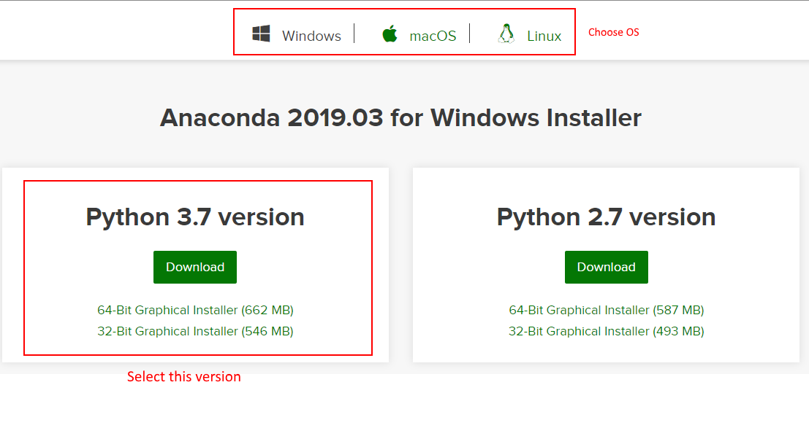
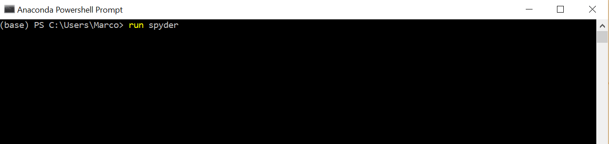
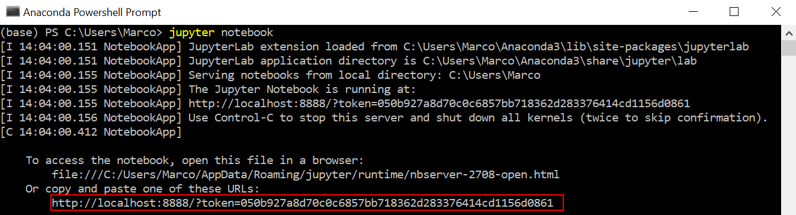
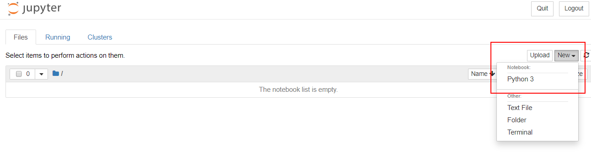
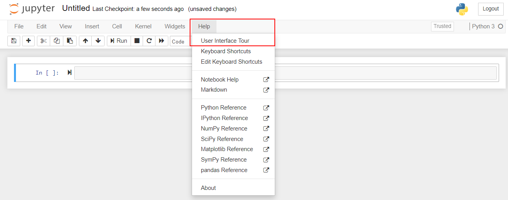
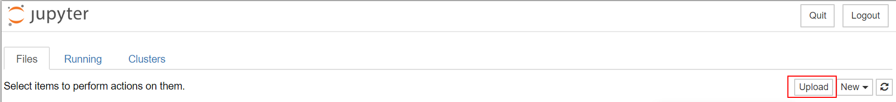

# **PYTHON FOR BIOLOGISTS 2: USING PANDAS**

With the basics out of the way, we can now turn our attention to Python libraries that provide significant added functionality. We'll start with `pandas`, an open-source library that provides a high level way to interact with and analyze data.

# Introduction

While lists and dictionaries are extraordinarily useful, using them to work with large, multi-dimensional datasets is both complicated and slow.

To remedy this inefficiency, `pandas` was created. It is built on on `numpy` (a library for scientific computing) and contains multiple high level functions that facilitate the whole process (importing data, modifying it, getting important statistics, formatting it, etc.) of data analysis.

## Installation

`pandas` can be installed individually or through **Anaconda**. Anaconda is essentially a version of Python that comes setup with lots of Python libraries that are useful for data science and machine learning.

It also includes other utilities such as Jupyter notebooks, a package manager, etc. which facilitate the use of Python for scientific computing. For these reasons, it's highly recommended to install it and use its distribution of Python to get `pandas` (the other libraries it contains will be essential for other workshops).

To download it, [click here](https://www.anaconda.com/distribution/) and select your operating system. Then, download the 3.7 version.

## Jupyter and Spyder

Anaconda comes with Jupyter and Spyder, both viable replacements for IDLE.

### Spyder

We've discussed Spyder previously as a Python IDE with significantly more functionality than IDLE. To test it out, search on your computer (`Windows button` or `command+space`) for `anaconda`. You should get the option to open the **Anaconda Powershell Prompt**, essentially Anaconda's version of the terminal.

Once there, you can open Spyder by typing the command `start spyder` and then hitting enter.

### Jupyter

As for Jupyter, it is in a category of its own. It's not a text editor or an IDE but rather a web application that allows you to create and run Python code blocks while putting formatted text in between. It's great for sharing and displaying your work as it allows others to both run your code and get explanations of how it works.

To do so, Jupyter allows you to create either Code cells or **Markdown** (simple language for formatting text, these workshops are written in Markdown!) cells. You can add and modify as many cells as you want. Cells can then be run either individually or all together.

To use Jupyter, head back to the Anaconda Powershell Prompt (see above),and use the command `jupyter notebook`. Doing so will start the web application and give you a URL you can copy paste into your browser's search bar to access the application.

If you're having trouble starting the jupyter notebook, you can try using [this desktop application](https://nteract.io/desktop) which starts jupyter for you. Alternatively, you can also use an online version of jupyter provided by [Google](https://colab.research.google.com/notebooks/welcome.ipynb). Just go to `File > Upload notebook..` and select the `ipynb` file and you'll be good to go!

Once there, click on `new > Notebook (Python 3)` to create a new notebook in which you can put your cells. This new notebook is saved in the folder where you started Jupyter as `.ipynb` file. It's recommended to start out by going to `Help > User Interface Tour` to get a better understanding of how Jupyter works.

Nonetheless, both are good options and a clear step up from IDLE. 

The rest of this workshop will be in a Jupyter Notebook. First download `Pandas.ipynb` and `dpyd_variants.csv` (in the data folder of Moodle) to a folder you can easily access. Then, start Jupyter as described above, go to the provided link and then select `Upload`. Once there, select the 2 files you just downloaded and upload them. 

Once uploaded, click on `Pandas.ipynb` to open the workshop and proceed from there. The next workshop on `matplotlib` and `seaborn` will also use a Jupyter notebook. Thus, once you're done, download `Plotting.ipynb` and `plotting.csv` (in the data folder of Moodle) and upload them.
